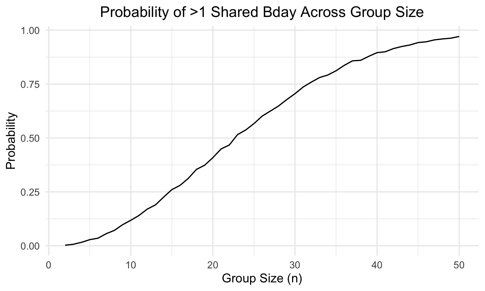
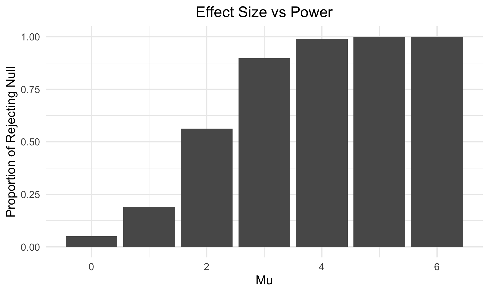
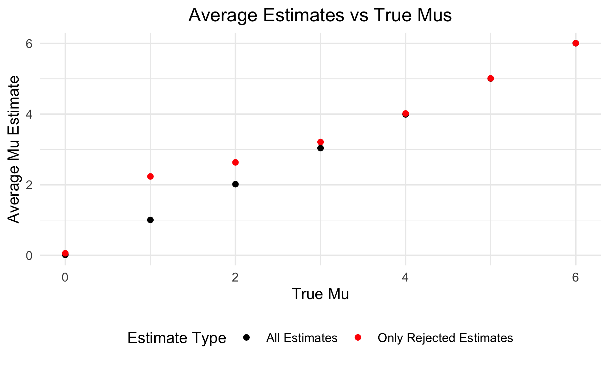
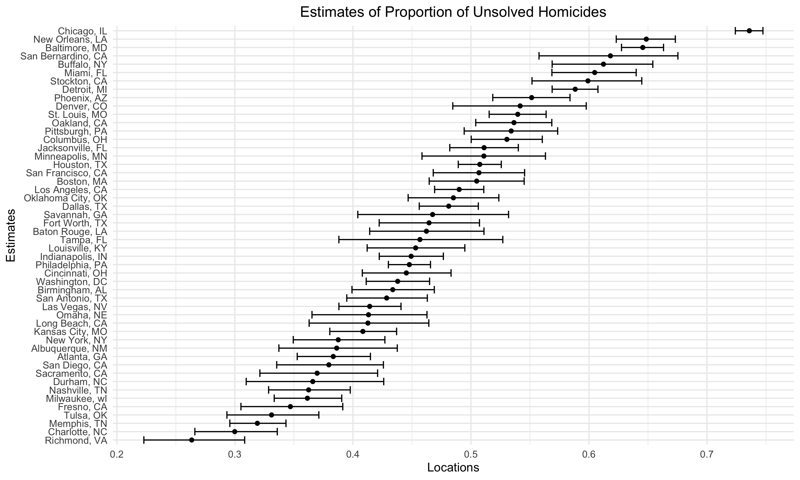

p8105_hw5_rs4338
================
Rebecca Shyu
2024-11-12

## Problem 0:

- Create a public GitHub repo + local R Project: p8105_h53_rs4338
- Create a single .Rmd file named p8105_hw5_rs4338.Rmd that renders to
  github_document
- Create a subdirectory (data) to store the local data files, and use
  relative paths to access these data files
- Submit a link to your repo via Courseworks:
  <https://github.com/rysgpd/p8105_hw5_rs4338>

## Problem 1:

- Write a function that, for a fixed group size, randomly draws
  “birthdays” for each person; checks whether there are duplicate
  birthdays in the group; and returns TRUE or FALSE based on the result.
- Run this function 10000 times for each group size between 2 and 50.
  For each group size, compute the probability that at least two people
  in the group will share a birthday by averaging across the 10000
  simulation runs.
- Make a plot showing the probability as a function of group size, and
  comment on your results.

``` r
birthday = function(n) {
  if (!is.numeric(n)) {
    stop("Input (group size) needs to be numeric")
  }
  
  bday_vec = sort(round(runif(n, min = 1, max = 365)))
  
  duplicates = sum(duplicated(bday_vec)) > 0

  return(duplicates)
}
```

Based on the following plot looking at probability of at least two
people in the group sharing a birthday as a function of group size, as
the group size increases, the probability gets closer to 1. This makes
sense because 0 to 50 is getting closer to the number of days in a year
(365 in this case) and we’re assuming that birthdays are uniformly
distributed (not true in reality) so the probability increases as we
draw more.

``` r
bday_sim =
  expand_grid(
    n = 2:50,
    iter = 1:10000
  ) %>% 
  mutate(
    results = map_lgl(n, birthday)
  ) %>% 
  group_by(n) %>% 
  summarize(prob = mean(results))

bday_sim %>% 
  ggplot(aes(x = n, y = prob )) + 
  geom_line() +
  labs(
    title = "Probability of >1 Shared Bday Across Group Size",
    x = "Group Size (n)",
    y = "Probability"
    ) +
  theme(plot.title = element_text(hjust = 0.5))
```



## Problem 2:

- Make a plot showing the proportion of times the null was rejected (the
  power of the test) on the y axis and the true value of 𝜇on the x axis.
  Describe the association between effect size and power.
- Make a plot showing the average estimate of 𝜇̂ on the y axis and the
  true value of 𝜇on the x axis. Make a second plot (or overlay on the
  first) the average estimate of 𝜇̂ only in samples for which the null
  was rejected on the y axis and the true value of 𝜇 on the x axis. Is
  the sample average of 𝜇̂ across tests for which the null is rejected
  approximately equal to the true value of 𝜇? Why or why not?

``` r
prob2_sim = function(mu) {
  
  n = 30
  alpha = 5

  sim_data = 
    tibble(
      x = rnorm(n, mean = mu, sd = alpha)
    )
  
  t_results = tidy(t.test(sim_data))
  
  out_df =
    tibble(
      p_val = t_results %>% pull(p.value),
      estimate_val = t_results %>% pull(estimate)
    )
  
  return(out_df)
}


prob2_results =
  expand_grid(
    mu = 0:6,
    iter = 1:5000
  ) %>% 
  mutate(
    t_tests = map(mu, prob2_sim)
  ) %>% 
  unnest(t_tests)
```

Based on the following plot, as mu (effect size) increased from 0 to 6,
the power (proportion of iterations rejecting the null - p-value less
than 0.05) also increased. The larger the effect size, the easier/larger
likelihood for the t-test to reject the null hypothesis.

``` r
prob2_results %>% 
  group_by(mu) %>% 
  summarise(proportion_reject = mean(p_val < 0.05)) %>% 
  ggplot(aes(x = mu, y = proportion_reject)) +
  geom_bar(stat = "identity") +
  labs(
    title = "Effect Size vs Power",
    x = "Mu",
    y = "Proportion of Rejecting Null"
    ) +
  theme(plot.title = element_text(hjust = 0.5))
```



This plot shows the average estimates of mu for all samples (black) and
only sames for which the null was rejected (red) vs the true value of mu
(0-6). I’ve overlayed both onto one plot for easy comparison. The black
dots are very close to the like y=x, but the red varies a lot until mu =
4 when it matches up with the black dots. This matches with the plot
right above where at mu=4, the power is almost to 1 and is approximately
equal to the true value of mu. Mu = 0 is interesting for the red dot
because the averaged estimates also includes negative numbers which
shows that it’s closer to the actual value, but it has very low power in
reality.

``` r
avg_est_all = 
  prob2_results %>% 
  group_by(mu) %>% 
  summarise(avg_mu_est = mean(estimate_val))

avg_est_reject = 
  prob2_results %>% 
  filter(
    p_val <= 0.05
  ) %>% 
  group_by(mu) %>% 
  summarise(avg_mu_est = mean(estimate_val)) 

ggplot() +
  geom_point(data = avg_est_all, aes(x = mu, y = avg_mu_est, color = "All Estimates")) +
  geom_point(data = avg_est_reject, aes(x = mu, y = avg_mu_est, color = "Only Rejected Estimates")) +
  scale_color_manual(values = c("All Estimates" = "black", "Only Rejected Estimates" = "red")) +
  labs(
    title = "Average Estimates vs True Mus",
    x = "True Mu",
    y = "Average Mu Estimate",
    color = "Estimate Type"
    ) +
  theme(plot.title = element_text(hjust = 0.5))
```



## Problem 3:

- Describe the raw data. Create a city_state variable (e.g. “Baltimore,
  MD”) and then summarize within cities to obtain the total number of
  homicides and the number of unsolved homicides (those for which the
  disposition is “Closed without arrest” or “Open/No arrest”).
- For the city of Baltimore, MD, use the prop.test function to estimate
  the proportion of homicides that are unsolved; save the output of
  prop.test as an R object, apply the broom::tidy to this object and
  pull the estimated proportion and confidence intervals from the
  resulting tidy dataframe.
- Now run prop.test for each of the cities in your dataset, and extract
  both the proportion of unsolved homicides and the confidence interval
  for each. Do this within a “tidy” pipeline, making use of purrr::map,
  purrr::map2, list columns and unnest as necessary to create a tidy
  dataframe with estimated proportions and CIs for each city.
- Create a plot that shows the estimates and CIs for each city – check
  out geom_errorbar for a way to add error bars based on the upper and
  lower limits. Organize cities according to the proportion of unsolved
  homicides.

``` r
homicide_df = read_csv("data/homicide-data.csv", na = c("", "Unknown"),
                       col_types = cols(
                         reported_date = col_date(format = "%Y%m%d"),
                         victim_sex = col_factor(levels = c("Female", "Male")),
                         victim_race = col_factor(),
                         disposition = col_factor()
                       )) %>% 
  janitor::clean_names() %>% 
  mutate(
    city_state = paste(city, state, sep = ", ")
  )

homicide_prop_df = 
  homicide_df %>% 
  group_by(city_state) %>% 
  summarise(total_homicides = n()) %>% 
  merge(
    homicide_df %>% 
      filter(
        disposition != "Closed by arrest"
      ) %>% 
      group_by(city_state) %>% 
      summarise(unsolved_homicides = n())
  )
```

The Homicide Dataset begins with 52179 rows/cases. It has 13 columns,
including date, name, demographics (age, race), location
(longitude/latitude, city, state), and disposition result.
homicide_prop_df is the dataset that summarizes within cities and
contains information about 1) total number of homicides and 2) number of
unsolved homicides (anything but closed by arrest).

``` r
baltimore_df = 
  homicide_prop_df %>% 
  filter(
    city_state == "Baltimore, MD"
  )


balt_results = prop.test(x = pull(baltimore_df, unsolved_homicides),
                         n = pull(baltimore_df, total_homicides))

final_balt = 
  balt_results %>% broom::tidy() %>% 
  select(estimate, conf.low, conf.high)


prob3_function = function(unsolved_homicides, total_homicides) {
  results = prop.test(x = unsolved_homicides,
                      n = total_homicides)
  
  return(results %>% broom::tidy() %>% 
           select(estimate, conf.low, conf.high))
}

homicide_result = 
  homicide_prop_df %>% 
  mutate(
    prop_tests = map2(unsolved_homicides, total_homicides, prob3_function)
  ) %>% 
  unnest_wider(prop_tests)

homicide_result %>% 
  mutate(
    city_state = reorder(city_state, estimate)
  ) %>% 
  ggplot(aes(y=city_state, x=estimate)) +
  geom_point() +
  geom_errorbar(aes(xmin=conf.low, xmax=conf.high))+
  labs(
    title = "Estimates of Proportion of Unsolved Homicides",
    x = "Locations",
    y = "Estimates"
    ) +
  theme(
    plot.title = element_text(hjust = 0.5)
    )
```



Glad I don’t live in Chicago. I’m surprised that NYC is along the lower
end, but happy to see it.
